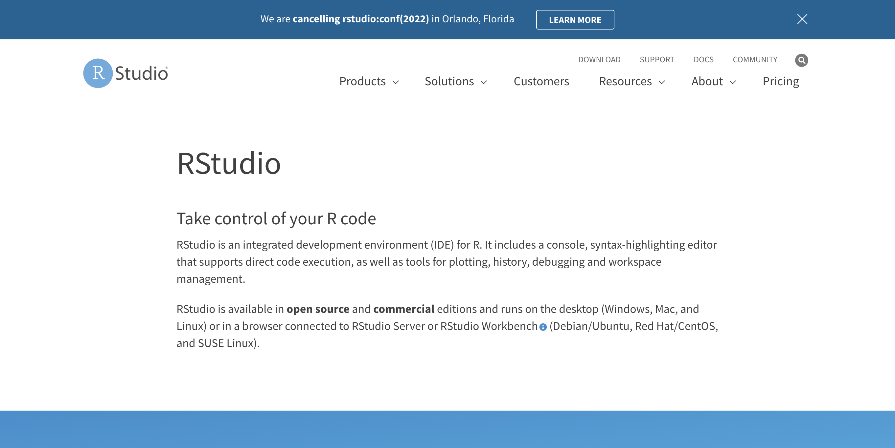

name: inter-slide
class: left, middle, inverse

{{ content }}

---
name: layout-general
layout: true
class: left, middle

```{r setup, child="loaders_fixers.Rmd", echo=FALSE, message=FALSE, warning=FALSE}

```

---

```{r , child="title_slide.Rmd", echo=FALSE, message=FALSE, warning=FALSE}

```


---
template: inter-slide

## `r fontawesome::fa("map", fill="white")`

### [`r fontawesome::fa("r-project")`](#history)

### [Rstudio](#rstudio)

### [Books](#books)


???
---

.f1[`r fontawesome::fa("r-project")`] is a software environment for

- statistical computing and

- graphics

distributed freely at `CRAN` under a `GPL 2/3 licence`

---

### `r fontawesome::fa("r-project")`

```{r, echo=FALSE, fig.width=12}
knitr::include_url("https://www.r-project.org")
```

---
template: inter-slide
name: history

## Brief history of `r fontawesome::fa("r-project")`


---

.fl.w-70.pa[

- 1976 _S_ programming language designed at Bell Labs
by John Chambers et al.

- 1998 _The New S Language_ (Blue Book)

- 1988 _S-PLUS_ first produced by a Seattle-based start-up company called Statistical Sciences, Inc.

- 1991-93 `r fontawesome::fa("r-project")` initated by [R. Ihaka](https://en.wikipedia.org/wiki/Ross_Ihaka) and 
<a href="https://en.wikipedia.org/wiki/Robert_Gentleman_(statistician)"> R. Gentleman</a>

- 1997 Formation of `r fontawesome::fa("r-project")` Core Team

- 2001 [Bioconductor](https://www.bioconductor.org)

- 2009-..., A group of packages called the [Tidyverse](https://www.tidyverse.org), which can be considered a _dialect of the R language_, is increasingly popular in the `r fontawesome::fa("r-project")` ecosystem


]

.fl.w-30.top.pa[


`r fontawesome::fa("r-project")`  is one of 5 languages with an Apache `Spark` API, the others being `Scala`, `Java`, `r fontawesome::fa("python")`, and `SQL`

]


???


---
exclude: true

```{r, echo=FALSE}
# library(DiagrammeR)
DiagrammeR::mermaid("
graph TB
    A --> B
    ",
  height = '100%',
  width = '100%')
```


---

### Aspects of `r fontawesome::fa("r-project")`

.fl.w-50[

###  `r fontawesome::fa("r-project")` as a Programming Language

- Functional (inherited from <a href="https://en.wikipedia.org/wiki/Scheme_(programming_language)"> Scheme</a>

- Object Oriented

- Interpreted 

- Written in `C` and `Fortran`

- Interfaced with `C, C++, Java`, `r fontawesome::fa("python")`, ...

- Interfaced with  SQL  `r fontawesome::fa("database")`

]

--

.fl.w-50[

### Environment REPL

- REPL: Read-Eval-Print-Loop 

- `r fontawesome::fa("r-project")` Application

- `ESS` Emacs Speaks Statistics

- `Rstudio` IDE `r fontawesome::fa("glass-cheers")`

- `Jupyter` notebooks

- VS Code 

...

]


---

### Kernel and packages

`r fontawesome::fa("r-project")` is made of a relatively stable core part (the kernel) and an ever growing collection of packages

Packages enrich the kernels in many ways:

- provide new modeling techniques (`nlme`, ...)

- visualization (`ggplot2`, `plotly`, ...)

- cleaner, more efficient data structures (`tibble`, `data.table`, ...)

- cleaner APIs (`lubridate`, `stringr`, ...)


---

### CRAN

- Comprehensive R-project Archive Network

```{r, echo=FALSE, fig.width=12}
knitr::include_url("https://pbil.univ-lyon1.fr/CRAN/")
```

Packages can also be installed from GitHub `r fontawesome::fa("github")` and other sources

---

### R-bloggers


```{r, echo=FALSE, fig.width=12}
knitr::include_url("https://www.r-bloggers.com")
```

---
template: inter-slide
name: rstudio

## Rstudio IDE

---

```{r, echo=FALSE, fig.width=12}

```

### [`r fontawesome::fa("link")` Rstudio Desktop IDE](https://www.rstudio.com/products/rstudio/)


---

### IDE

- Editor(s)

- Console(s)

- Viewer(s)

- Misc.
  + Versioning
  + Environment monitoring
  + ...

---

### Use cases

- Programming/Package developments

- **Reporting**

- ...

---

### RMarkdown

```{r, echo=FALSE, fig.width=12}
knitr::include_url("https://rmarkdown.rstudio.com/index.html")
```

---

### [Literate programming](https://en.wikipedia.org/wiki/Literate_programming)

> Literate programming is a programming paradigm introduced by Donald Knuth in which a computer program is given an explanation of its logic in a natural language, such as English, interspersed with snippets of macros and traditional source code, from which compilable source code can be generated. The approach is used in scientific computing and in data science routinely for reproducible research and open access purposes. Literate programming tools are used by millions of programmers today.


---

### Reproducible (statistical) research

.fl.w-60.pa2[



]


.fl.w-40.pa2[

**A pipeline**

- Data gathering

- Data wrangling

- Exploratory Data Analyis (and Visualization)

- Modeling prediction

- Reporting (paper, html, interactive dashboard, ...)


]


---


### Reproducible (statistical) research (cont'd)


.fl.w-60.pa2[


]

.fl.w-40.pa2[

### A pipeline

The pipeline is defined by solid arrows

It may be (partially) iterated (several times)

The reports need to be updated every time

- data are edited/reshaped

- models are modified

]
---

### Reproducible (statistical) research (cont'd)

.fl.w-50.pa2[

**A pipeline**

- Data gathering

- Data wrangling

- Exploratory Data Analyis (and Visualization)

- Modeling prediction

- Reporting (paper, html, interactive dashboard, ...)

]

.fl.w-50.pa2[

- The pipeline may be iterated several times

- Gluing the different steps in a manageable way is vital

- `RMarkdown` does just that `r fontawesome::fa("glass-cheers")`

- [`Quarto`](https://quarto.org) is an improvement/extension of `RMarkdown`

]


```{r pipeline-mmd, echo=FALSE, eval=FALSE}
DiagrammeR::mermaid("
    graph TD;
    id1[Data gathering] -->  id2[Data wrangling];
    id2[Data wrangling] -->  id3[Exploratory Data Analyis and Visualization];
    id3[Exploratory Data Analyis and Visualization] -.-> id1[Data gathering] ;
    id3[Exploratory Data Analyis and Visualization] -.-> id2[Data wrangling]  ;
    id3[Exploratory Data Analyis and Visualization] --> id4[Modeling Causal/Predictive] ;
    id4[Modeling Causal/Predictive] --> id5[Reporting paper, html, interactive dashboard, ...] ;
    id4[Modeling Causal/Predictive] -.-> id1[Data gathering] ;
    id4[Modeling Causal/Predictive] -.-> id2[Data wrangling] ;
", height="800px")

?DiagrammeR::mermaid()

```


---
template: inter-slide
name: books

## Books  and references

---

The Web offers many valuable resources for learning  `r fontawesome::fa("r-project")` either as a beginner or as seasoned statistician 

- [Online books](https://bookdown.org)

- [Cheatsheets](https://www.rstudio.com/resources/cheatsheets/)

- [Datacamp](https://www.datacamp.com/)

- [Udacity](https://www.udacity.com)

- [Stackoverflow](https://stackoverflow.com/questions/tagged/r)

- [R job interviews](https://www.edureka.co/blog/interview-questions/r-interview-questions/)

- ...

---

```{r, echo=FALSE, fig.width=12}
knitr::include_url("https://rstudio-education.github.io/hopr/")
```

---

```{r, echo=FALSE, fig.width=12}
knitr::include_url("https://r4ds.had.co.nz")
```

---

```{r, echo=FALSE, fig.width=12}
knitr::include_url("https://adv-r.hadley.nz")
```

---

```{r child='closing_slide.Rmd'}

```
