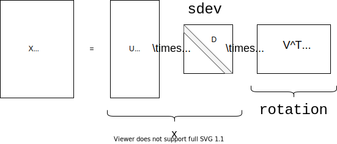

name: layout-general
layout: true
class: left, middle


```{r setup, child="loaders_fixers.Rmd", echo=FALSE, message=FALSE, warning=FALSE}
```

```{r, echo=FALSE}
knitr::opts_chunk$set(fig.width = 6,
                      message = FALSE,
                      warning = FALSE,
                      comment = "",
                      cache = F)

pacman::p_load(flipbookr)
pacman::p_load(FactoMineR)
pacman::p_load(FactoInvestigate)
pacman::p_load(ggrepel)
pacman::p_load(ggfortify)
pacman::p_load(broom)
opts <- options()  # save old options

options(ggplot2.discrete.colour="viridis")
options(ggplot2.discrete.fill="viridis")
options(ggplot2.continuous.fill="viridis")
options(ggplot2.continuous.colour="viridis")

# xaringanExtra::use_scribble()
```

---
name: inter-slide
class: left, middle, inverse

{{content}}

---
template: inter-slide

# Exploratory Data Analysis VI: PCA

### `r Sys.Date()`

#### [`r params$curriculum`](`r params$homepage_curriculum`)

#### [`r params$coursetitle`](`r params$homepage`)

#### [`r params$lecturer`](http://stephane-v-boucheron.fr)

---
template: inter-slide

### [Appetizer](#appetizer)  `r fontawesome::fa("map", fill="white")`

### [Approximating a sample matrix](#approx)

### [Singular Value Decomposition](#svd)

### [Eckart-Young Theorems](#eckart-young)

### [Computing SVD](#computing-svd)

### [PCA and SVD](#pca-svd)

### [Visualizing PCA](#vis-pca)


```{r, echo=FALSE, message=FALSE}
iris <- datasets::iris
```

---
template: inter-slide
name: approx

## Approximating a sample matrix

---

### A dimension reduction technique

Principal Component Analysis (PCA) is an ancient dimension reduction technique from statistics that may be motivated from different perspectives:

- maximizing projected variance

- minimizing reconstruction error

---
name: big-picture


#### The big picture

.bg-light-gray.b--light-gray.ba.bw1.br3.shadow-5.ph4.mt5[

The central idea of principal component analysis (PCA) is to reduce the
dimensionality of a data set which consists of a large number of interrelated
variables, while retaining as much as possible of the variation present in the
data set.

This is achieved by transforming to a new set of variables, the
principal components (PCs), which are uncorrelated, and which are ordered
so that the first few retain most of the variation present in all of the original
variables.

.tr[Jolliffe 1986]

]

---

### PCA: under the hood

PCA can be performed using

- _spectral decomposition_ of a data covariance (or correlation) matrix or

- _singular value decomposition_ of a data matrix,

possibly after a normalization step of the initial data.

The main device is a _matrix factorization method_ known as Singular Value Decomposition (SVD)


---
template: inter-slide
name: svd

## Singular value decomposition

---

The next theorem tells us that any real-valued matrix can be _factorized_
into the product of two orthogonal matrices and a diagonal matrix

This _factorization_ is at the core of many results and methods in computational
matrix analysis.

From a computational viewpoint, Principal Component Analysis (PCA) is
another name for Singular Value Decomposition (SVD)

---


### Théorème: Singular Value Decomposition Theorem

.bg-light-gray.b--light-gray.ba.bw1.br3.shadow-5.ph4.mt5[

Let $X$ be a $n \times p$ real matrix

There exists $U, D, V$

$$X =  U \times D \times V^T \qquad\text{with} \begin{cases}  U \times U^T & = \operatorname{Id}_n \\  V \times V^T & = \operatorname{Id}_p \\  D & \text{non-negative diagonal.}\end{cases}$$

]

--


- The columns of $U$  are called _left singular vectors_.

- The columns of $V$ are called the  _right singular vectors_.

- The diagonal coefficients of $D$ are called the _singular values_.

---

###  `r fontawesome::fa("binoculars")`


$$X =  U \times D \times V^T \qquad\text{with} \begin{cases}  U \times U^T & = \operatorname{Id}_n \\  V \times V^T & = \operatorname{Id}_p \\  D & \text{non-negative diagonal.}\end{cases}$$

```{r, echo=FALSE}

```


---

### `r fontawesome::fa("hand-point-right")`

The SVD decomposition is not unique.

$M := \begin{pmatrix} 0 & 1 \\ 1 & 0 \end{pmatrix}$  is orthogonal but it is not a rotation

$$\begin{array}{rl}\begin{pmatrix} 0 & 1 \\ 1 & 0 \end{pmatrix} & =  \begin{pmatrix} 0 & 1 \\ 1 & 0 \end{pmatrix} \times\begin{pmatrix} 1 & 0 \\ 0 & 1 \end{pmatrix} \times \begin{pmatrix} 1 & 0 \\ 0 & 1 \end{pmatrix}\\ & = \begin{pmatrix} 1 & 0 \\ 0 & 1 \end{pmatrix} \times \begin{pmatrix} 1 & 0 \\ 0 & 1 \end{pmatrix} \times \begin{pmatrix} 0 & 1 \\ 1 & 0 \end{pmatrix} \\ &  =  \ldots\end{array}$$


---
exclude: true

```{r fancy_svd, echo=FALSE, include=FALSE, eval=FALSE}
M <- matrix(c(0,1,1,0), nrow=2)
knitr::kable(data.frame(list("sing values"=svd(M)$d, "eigenvalues"= eigen(M)$values)))
```

---

### Proposition

.bg-light-gray.b--light-gray.ba.bw1.br3.shadow-5.ph4.mt5[

The number of positive (non-zero) singular values equals the rank of $X$

]

---

### Definition :  Thin SVD

Let $X$ be a $n \times p$ real matrix with rank $r$.

Let  $U, D, V$ be a singular value decomposition of $X$ such that the diagonal
entries of $D$ are non-increasing.

Let $U_r$ (resp. $V_r$) be the $n \times r$ (resp. $p \times r$) matrix
formed by the first $r$ columns of $U$ (resp. $V$)

Then

$$X =  U_r \times D_r \times V_r^T$$

is a _thin Singular Value Decomposition_ of $X$.

---
exclude: true

```{r, echo=FALSE, include=FALSE, eval=FALSE}
A <- matrix(rnorm(12, 1), nrow = 4)

foo <- svd(A)

U <- foo$u

D <- foo$d

V <- foo$v

xtable::xtableMatharray(A)
xtable::xtableMatharray(U)
xtable::xtableMatharray(diag(D))
xtable::xtableMatharray(t(V))
```

---

### Example

.f6[

In `r fontawesome::fa("r-project")`, the SVD of matrix $A$ is obtained by `svd_ <- svd(A)`
with `U <- svd_$u`, `V <- svd_$V` and `D <- diag(svd_$d)`


$$\begin{array}{rl}& \underbrace{\begin{bmatrix}  3.33 & 0.77 & 2.33 \\  0.98 & 1.94 & 1.71 \\
  -0.74 & -0.60 & 1.06 \\  1.65 & 0.17 & 2.90 \\  \end{bmatrix}}_{A} \\ &= \underbrace{\begin{bmatrix}
  -0.71 & 0.28 & -0.48 \\  -0.42 & 0.27 & 0.86 \\
  -0.02 & -0.75 & 0.16 \\  -0.56 & -0.54 & -0.04 \\ \end{bmatrix}}_{U} \times
\underbrace{\begin{bmatrix}  5.66 & 0.00 & 0.00 \\ 0.00 & 1.87 & 0.00 \\ 0.00 & 0.00 & 1.58 \\ \end{bmatrix}}_{D}  \times \underbrace{\begin{bmatrix} -0.65 & -0.25 & -0.71 \\ 0.48 & 0.59 & -0.65 \\  -0.59 & 0.76 & 0.27 \\  \end{bmatrix}}_{V^T}\end{array}$$

]

---

During the proof of the SVD Theorem, we rely on the next matrix norm.


### Definition : operator norm

$$\|\mathbf{M} \|_{\text{op}} :=  \sup_{u \in \mathbb{R}^n  \|u\|\leq 1}\sup_{v \in \mathbb{R}^p  \|v\|\leq 1} u^T \mathbf{M} v = \sup_{v \in \mathbb{R}^p  \|v\|\leq 1} \| \mathbf{M} v \|$$


---


### Proof of full SVD existence

**Induction on $\max(n,p)$**

If $\max(n,p)=1$ nothing to do. The matrix is (almost) its own SVD.


Assume SVD exists for any matrix $n\times p$ with $\max(n,p)\leq m$}

**Convention.**
Let $\mathbf{Z}$  be an $n\times p$ matrix with $\max(n,p)=m+1$ and rank $r\leq \min(n,p)$.

If $\|\mathbf{Z}\|_{\text{op}}=0$,
 $\operatorname{rank}(\mathbf{Z})=0, \mathbf{Z}=\mathbf{0}$ and there is nothing to prove

If $\|\mathbf{Z}\|_{\text{op}}>0$,
 by compactness of unit ball $B^p_2(1)$ in $\mathbb{R}^p$, there exist unit
vectors $\widehat{u} \in \mathbb{R}^n, \widehat{v} \in \mathbb{R}^p$,
$$\|\mathbf{Z}\|_{\text{op}} = \widehat{u}^T \mathbf{Z} \widehat{v} = \sup_{u \in B_2^n(1), v\in B^p_2(1) } u^T \mathbf{Z} v$$

---

### Proof of full SVD existence (continued)

- Let $\sigma_1 = \|\mathbf{Z}\|_{\text{op}}$

- Let $\mathbf{A}$, $\mathbf{B}$  be matrices such that

$$\begin{bmatrix} \widehat{u} & \vdots  & \mathbf{A} \end{bmatrix} \qquad \text{and}\qquad \begin{bmatrix} \widehat{v} & \vdots & \mathbf{B} \end{bmatrix}$$

be *orthognal* matrices with dimensions $n\times n$ and $p\times p$


---

### Proof of full SVD existence (continued)

Decomposing matrices into blocks:

$$\begin{bmatrix}\widehat{u}^T\\ \mathbf{A}^T\end{bmatrix} \times \mathbf{Z} \times \begin{bmatrix} \widehat{v} & \mathbf{B}\end{bmatrix} =  \begin{bmatrix}\sigma_1 & w^T  \\ \mathbf{0} & \mathbf{A}^T \mathbf{Z} \mathbf{B}\end{bmatrix} =: \mathbf{Y}$$

$\mathbf{A}^T \mathbf{Z} \widehat{v} = \mathbf{0}$ since

- $\mathbf{Z} \widehat{v}$ is colinear with $\widehat{u}$ and

- the columns of $\mathbf{A}$ are orthogonal to $\widehat{u}$

---

### Proof of full SVD existence (continued)


Now, we have to check that $w=0$

Because multiplying by orthogonal matrices does not change operator norm $\|\mathbf{Y}\|_{\text{op}}=\|\mathbf{Z}\|_{\text{op}} = \sigma_1$

$$\|\mathbf{Y}\|_{\text{op}} \geq \frac{\left\|\mathbf{Y} \begin{bmatrix}\sigma_1 \\ w \end{bmatrix}\right\|}{\left\|\begin{bmatrix}\sigma_1 \\ w \end{bmatrix}\right\|} \geq \frac{\sigma_1^2 +w^Tw}{\sqrt{\sigma_1^2 +w^Tw}} = \sqrt{\sigma_1^2 +w^Tw}$$

In order to have $\sigma_1 \geq \|\mathbf{Y}\|_{\text{op}}$, we need to have $w=\mathbf{0}$

Matrix $\mathbf{A}^T \mathbf{Z} \mathbf{B}$ (with rank $r-1$)
satisfy the induction hypothesis ( $\max(n-1,p-1)\leq m$ )

---

### Proof of full SVD existence (continued)

$\rightarrow$ There exist  orthogonal matrices $\mathbf{U}'$  and $\mathbf{V}'$
such that ${\mathbf{U}'}^T \mathbf{A}^T \mathbf{Z} \mathbf{B} \mathbf{V}'$ is equal to a diagonal non-negative matrix $\mathbf{D}'$ with $r-1$ non null-coefficients

This entails

$$\begin{bmatrix} 1 & \mathbf{0} \\ \mathbf{0} &  \mathbf{U'}^T\end{bmatrix} \times \begin{bmatrix}
\widehat{u}^T\\\mathbf{A}^T\end{bmatrix} \times \mathbf{Z} \times \begin{bmatrix} \widehat{v} & \mathbf{B}\end{bmatrix} \times \begin{bmatrix}1 & \mathbf{0} \\ \mathbf{0} &  \mathbf{V}'\end{bmatrix}  = \begin{bmatrix}\sigma_1 & \mathbf{0} \\ \mathbf{0} & \mathbf{D}'\end{bmatrix}$$

Matrices

$$\begin{bmatrix} 1 & \mathbf{0} \\ \mathbf{0} &  \mathbf{U'}^T \end{bmatrix} \times \begin{bmatrix} \widehat{u}^T\\ \mathbf{A}^T \end{bmatrix}\qquad \text{and} \qquad \begin{bmatrix} \widehat{v} & \mathbf{B}\end{bmatrix} \times \begin{bmatrix} 1 & \mathbf{0} \\ \mathbf{0} &  \mathbf{V}'\end{bmatrix}$$

are orthogonal with dimensions $n\times n$ and $p\times p$.

`r fontawesome::fa("square")`

---

### Take-home message  `r fontawesome::fa("bullhorn")`


The SVD theorem is a factorization theorem:

.tr[it allows to break up a matrix into simpler objects]

There is  something special about SVD beyond factorization.

SVD delivers a sequence of _best approximations with given rank_

The low-rank approximations are simultaneously optimal with respect to two norms (operator and Hilbert-Schmidt)

This is the content of the _Eckart-Young Theorem_

---
template: inter-slide
name: eckart-young

## Eckart-Young Theorem

---

### Landscape : Two relevant norms on $\mathcal{M}_{n,p}$ the set of $n\times p$ matrices

The first relevant norm is the _operator norm_ defined above

The second norm is the _Hilbert-Schmidt-Frobenius norm_

---


### `r fontawesome::fa("syringe")` Definition: Hilbert-Schmidt inner product and norm


.bg-light-gray.b--light-gray.ba.bw1.br3.shadow-5.ph4.mt5[

$$\langle \mathbf{A}, \mathbf{B} \rangle_{\text{HS}} :=  \operatorname{Trace}(\mathbf{A} \mathbf{B}^T) \qquad \| \mathbf{A} \|_{\text{HS}}^2 :=  \langle \mathbf{A}, \mathbf{A} \rangle_{\text{HS}} = \sum_{i=1}^n\sum_{j=1}^p \mathbf{A}_{i,j}^2$$

- $\langle \cdot, \cdot \rangle_{\text{HS}}$ is an inner product (symmetric, bilinear, positive)

- $\|\cdot \|_{\text{HS}}$ is a norm (satisfies triangle inequality, positive, scaling property)

]

---

### Theorem (Optimality of Truncated SVD)

.bg-light-gray.b--light-gray.ba.bw1.br3.shadow-5.ph4.mt5[

The _truncated SVD_ leads to the best rank- $k$ approximation
with respect to the Hilbert-Schmidt norm and the operator norm

]


---


### A basis for $\mathbb{R}^{n \times p}$


### Proposition

.bg-light-gray.b--light-gray.ba.bw1.br3.shadow-5.ph4.mt5[

Let $u_1, \ldots, u_n$ and $v_1,\ldots,v_p$
form two orthonormal bases of $\mathbb{R}^n$ and $\mathbb{R}^p$,

then 

$\left(u_i \times v_j^T\right)_{i\leq n, j\leq p}$ forms an orthonormal
basis of $\mathbb{R}^{n\times p}$

]

---

### Proof

$$\begin{array}{rcl}\langle u_i v_j^T, u_k v_\ell^T\rangle_{HS} & = &  \operatorname{Trace}\left( u_i v_j^T v_\ell u_k^T\right) \\  &= & \langle v_j, v_\ell\rangle  \operatorname{Trace}\left( u_i  u_k^T\right) \\  &= & \langle v_j, v_\ell\rangle \times \langle u_i, u_k\rangle \end{array}$$

`r fontawesome::fa("square")`


---


### Corollary

.bg-light-gray.b--light-gray.ba.bw1.br3.shadow-5.ph4.mt5[

The left and right singular vectors in the full SVD of an $n\times p$ matrix form an orthonormal basis of $\mathbb{R}^{n\times p}$ endowed with Hilbert-Schmidt norm

]

---

### Proof

**Best approximation in Hilbert-Schmidt norm (proof)**

Assume $n\geq p$ (w.l.o.g.),

From the fat SVD for $\mathbf{Z}$, we have

$$\mathbf{Z} =  \sum_{i=1}^p \sigma_i u_i v_i^T\qquad \text{where } \sigma_1\geq \ldots \geq \sigma_r > \sigma_{r+1} = \ldots = \sigma_p= 0$$


---

### Proof (continued)

Let

$$\mathbf{W} = \sum_{i\leq n,j\leq p} \mu_{i,j} u_i v_j^T$$

$$\left\| \mathbf{Z} - \mathbf{W} \right\|_{HS}^2 = \sum_{i=1}^p  (\sigma_i^2 - \mu_{i,i})^2+ \sum_{i=1}^n\sum_{j=1}^p \mathbb{I}_{i\neq j}  \mu_{i,j}^2$$

- Any minimizer should satisfy $\mu_{i,j}=0$ for $i\neq j$

- $\sum_{i\leq p} \mu_{i,i} u_iv_i^T$ has rank $k$ iff
exactly $k$ coefficients $\mu_{i,i}$ are non zero

- The squared distance is minimized by picking $\mu_{i,i}=\sigma_i$
for $i\leq k$ and $\mu_{i,i}=0$  for $k+1 \leq i \leq p$

---


### Proof (continued)

**Best approximation in operator norm**

The SVD of $\mathbf{Z}-\mathbf{Z}_k$ is

$$\mathbf{U}\times  \operatorname{diag}\left(\begin{array}{c} 0 \\ \vdots\\ 0 \\ \sigma_{k+1}\\ \vdots \\ \sigma_p \end{array} \right)\times  \mathbf{V}^T$$

The operator norm of the difference is equal to $\sigma_{k+1}$

Now, let $\mathbf{W}$  be of rank $k$. $\operatorname{ker}(\mathbf{W})$ has dimension $p-k$,
is intersects the linear span of the first $k+1$ columns of $\mathbf{V}$.

---

### Proof (continued)


Let $y$ be a unit vector in this intersection. By definition $\mathbf{W}y=0$.

$$\| \mathbf{Z}y \|^2 = \sum_{i=1}^{k+1} \sigma_i^2 \langle v_i, y_i \rangle^2 \geq \sigma^2_{k+1}$$

which proves that $\| \mathbf{Z} - \mathbf{W}\|_2 \geq \sigma_{k+1}$


`r fontawesome::fa("square")`

---
template: inter-slide
name: pca-svd


## Two perspectives on PCA (and SVD)

---

.fl.w-50.pa2[
### Faithful projection

Let $X$ be a $n \times p$ matrix, a reasonable task consists in finding
a $k \lll p$-dimensional subspace $E$ of $\mathbb{R}^p$ such that

$$X \times \Pi_E$$

is as close as possible from $X$. By as close as possible, we mean that the sum
of squared Eudlidean distances between the rows of $X$ and
the rows of $X \times \Pi_E$ is as small as possible

Picking $E$ as the subspace generated by the first $k$ right-singular vectors of $X$  solves the problem
]

.fl.w-50.pa2[
### Maximizing the projected variance

Let $X$ be a $n \times p$ matrix, a reasonable task consists in finding
a $k \lll p$-dimensional subspace $E$ of $\mathbb{R}^p$ such that

$$X \times \Pi_E$$

retains as much variance as possible.

This means maximizing

$$\operatorname{var}\left(X \times \Pi_E\right)$$

]


---
template: inter-slide
name: computing-svd

## Computing SVD

---

### Proposition

.bg-light-gray.b--light-gray.ba.bw1.br3.shadow-5.ph4.mt5[

Computing the SVD is not more costly than computing the spectral decomposition of a symmetric matrix

]


---
exclude: true 

### Proof

If we feed a symmetric matrix $A$ to an SVD algorithm,
we obtain $U, D, V$ such that $A = U \times D \times V^T$.

Then,  we also have

$$A =  \frac{1}{2} \left((U+V) \times D \times (U+V)^T \right)$$

which defines a spectral decomposition of $A$  `r fontawesome::fa("glass-cheers")`

---

### Proof 

If we have an eigendecomposition algorithm (say `eigen`), we can feed it with

- symmetric matrix $A \times A^T$ to get the _left singular vectors_ as _eigenvectors_ of $A \times A^T$  and
- symmetric matrix $A^T \times A$ to get the _right singular vectors_ as _eigenvectors_ of $A^T \times A$

Both spectral decompositions lead to the squared singular values

If we count the number of field operations, both problems are linearly equivalent (matrix multiplication is less expansive 
than spectral or singular value decomposition).


`r fontawesome::fa("glass-cheers")`

`r fontawesome::fa("square")`


---
template: inter-slide
name: pca-up-running

##  PCA up and running


---

We will walk through Principal Component Analysis using historical datasets

- `USArrests`: crime data across states (individuals) in USA

- `iris`: morphological data of 150 flowers (individuals) from genus _iris_

- `decathlon`: scores of athletes at the ten events making a decathlon

- Life tables for a collection of Western European countries  and the USA

`r fontawesome::fa("exclamation-triangle")` Some datasets have non-numerical columns. 

Such columns are not used when computing the SVD that underpins PCA 

But non-numerical columns may be incorporated into PCA visualization

???

When PCA is used as a feature engineering device to prepare the dataset for regression, supervised classification, clustering or any other statistical/machine learning treatment, visualizing the interplay between non-numerical columns and the numerical columns
constructed by PCA is crucial


---


### Iris flower dataset

A showcase for Principal Component Analysis

.fl.w-60.pa2.f6[

> The Iris flower data set or Fisher's Iris data set is a multivariate data set introduced by Ronald Fisher in 1936. Edgar Anderson collected the data to quantify the morphologic variation of Iris flowers of three related species. Two of the three species were collected in the Gaspé Peninsula "all from the same pasture, and picked on the same day and measured at the same time by the same person with the same apparatus"

> The data set consists of 50 samples from each of three species of Iris (Iris setosa, Iris virginica and Iris versicolor). Four features were measured from each sample: the length and the width of the sepals and petals, in centimeters

.tr[[Wikipedia](https://en.wikipedia.org/wiki/Iris_flower_data_set)]

`r fontawesome::fa("pagelines")`
]

.fl.w-40.pa2[


```{r, echo=FALSE}

```


]
---

### `USArrests`

.fl.w-60.f6[

```{r, echo=FALSE}
data(USArrests)

USArrests %>%
  sample_n(10) %>%
  knitr::kable()
```

4 numerical columns, questionable scalings
]


.fl.w-40[
```{r, echo=FALSE, message=FALSE, warning=FALSE}
USArrests %>%
  rownames_to_column() %>%
  ggplot() +
  aes(x = Assault, y = Murder) +
  aes(colour = UrbanPop, label=rowname) +
  geom_point(size = 5) +
  geom_text_repel(box.padding = unit(0.75, "lines"))
```
]


---

### Decathlon


.fl.w-60.f6[

```{r, echo=FALSE}
data(decathlon)

decathlon %>%
  rownames_to_column() %>%
  dplyr::select(-c(`400m`, `110m.hurdle`, `Shot.put`,`Javeline`, `1500m`, `Rank`, `Competition`, `Points`)) %>%
  sample_n(10) %>%
  knitr::kable()
```

10 numerical columns, questionable scalings
]


.fl.w-40[
```{r, echo=FALSE, message=FALSE, warning=FALSE}
decathlon %>%
  rownames_to_column() %>%
  ggplot() +
  aes(x = `100m`, y = Long.jump) +
  aes(colour = Points, label=rowname) +
  geom_point(size = 5) +
  geom_smooth(se = FALSE) +
  geom_smooth(method="lm", se=FALSE) +
  geom_text_repel(box.padding = unit(0.75, "lines"))
```
]
---


### Using `prcomp` from base `r fontawesome::fa("r-project")`

> The calculation is done by a singular value decomposition of the (centered and possibly scaled) data matrix, not by using `eigen` on the covariance matrix.

> This is generally the preferred method for numerical accuracy.

> The `print` method for these objects prints the results in a nice format and the plot method produces a _scree plot_

At first glance, performing Principal Component Analysis
consists in applying SVD to the $n  \times p$ data matrix.

---

### Raw PCA on `iris` dataset

.fl.w-50.pa2[
```{r pca_iris_1, echo=TRUE, eval=TRUE}
pca_iris <- iris %>%
  select(- Species) %>%
  prcomp(x = .,          #<<
         center = FALSE, #<<
         scale. = FALSE) #<<

class(pca_iris) ; is.list(pca_iris)

names(pca_iris)
```
]

.fl.w-50.pa2[

Result has 5 components:

- `sdev`: singular values

- `rotation`: orthogonal matrix $V$ in SVD

- `center`: `FALSE` or centering row  vector

- `scale`: FALSE of scaling row vector

- `x`: matrix $U \times D$ from SVD

]

---

### `prcomp`  and SVD

.fl.w-50.pa2[

Result has 5 components:

- `sdev`: singular values

- `rotation`: orthogonal matrix $V$ in SVD

- `center`: `FALSE` or centering row  vector

- `scale`: FALSE of scaling row vector

- `x`: matrix $U \times D$ from SVD

]

.fl.w-50.pa2[

```{r, echo=FALSE}

```

]


---

### From data to PCA and back

Let

- $Z$ be the $n \times p$ matrix fed to `prcomp`
- $X$ be the $n \times p$ matrix forming component `x` of the result
- $V$ be the $p \times p$ matrix forming component `rotation` of the result
- $\mu$ be the centering vector, $\mathbf{0}$ if `center=FALSE`
- $\sigma$ be the scaling vector, $\mathbf{1}$ is `scale.=FALSE`

then

$$\text{diag}(\sigma) \times (Z - \mathbf{1} \times \mu^T) =  X \times V^T$$

or

$$Z  =  \text{diag}(\sigma)^{-1} \times  X \times V^T +  \mathbf{1} \times \mu^T$$


???

PCA can be pictured as follows

- optional centering and scaling
- performing SVD
- gathering the byproducts of SVD  so as to please statisticians
- possibly truncating the result so as to obtain a truncated SVD

---

### Glossary

The columns of components `x`  are called the _principal components_ of the dataset

`r fontawesome::fa("exclamation-triangle")` Note that the precise connection between the principal components and the dataset depend on centering and scaling


---

### Conventions

| PCA vocabulary | SVD vocabulary |
|:---------------|:----------------|
| Principal axis | Left singular vector |
| Principal component | Scaled  left singular vector |
| Factorial axis | Right singular vector |
| Component of inertia | Squared singular value |

---

### Modus operandi

1. Read the data.

2. Choose the active individuals and variables (cherrypick amongs numeric variables)

3. Choose if the variables need to be standardised

4. Choose the number of dimensions you want to keep (the _rank_)

5. Analyse the results

6. Automatically describe the dimensions of variability

7. Back to raw data.


---

### Impact of standardization and centering

When performing PCA, once the _active variables_ have been chosen,
we wonder whether we should centre and/or standardize the columns


--

`r fontawesome::fa("hand-point-right")` PCA investigates the spread of the data not their location

`r fontawesome::fa("question-circle")` To standardize or not to standardize?

There is no universal answer

`r fontawesome::fa("hand-point-right")` Centering is performed by default when using `prcomp`

---

### Centering/Scaling: iris dataset

On iris dataset Centering and standardizing the columns slightly spreads out the eigenvalues

.fl.w-50.pa2.f6[

```{r}
iris <- datasets::iris
iris_num <- dplyr::select(iris, -Species)

list_pca_iris <-
  map2(.x=rep(c(FALSE, TRUE), 2),
       .y=rep(c(FALSE, TRUE), c(2,2)),
       ~ prcomp(iris_num, center= .x, scale.=.y)
)

names(list_pca_iris) <- stringr::str_c("pca_iris",
    c("", "c", "s", "c_s"),
    sep="_")
```

]

.fl.w-50.pa2[

```{r, echo=FALSE}
config_param <- as.vector(outer(c("_", "center"),
                          c("_", "scale"), FUN=paste)) %>%
                rep( c(4,4,4,4))

list_pca_iris %>%
  purrr::map_dfr(~ broom::tidy(., matrix="pcs")) %>%
  mutate(Parameter=config_param) -> df_pca_iris_c_s

p_pca_c_s <- df_pca_iris_c_s %>%
  ggplot() +
  aes(x=PC, y=percent, fill=Parameter) +
  geom_col(position="dodge")

p_pca_c_s +
  labs(title="Iris : share of inertia per PC",
       subtitle = "Centering, scaling or not")
```

]


---

### More on the centering/scaling dilemma

```{r , echo=FALSE}

usarrests_num <- USArrests
data(decathlon)

list_pca_usarrests <-
  map2(.x=rep(c(FALSE, TRUE), 2),
       .y=rep(c(FALSE, TRUE), c(2,2)),
       ~ prcomp(USArrests, center= .x, scale.=.y)
)

list_pca_decathlon <-
  map2(.x=rep(c(FALSE, TRUE), 2),
       .y=rep(c(FALSE, TRUE), c(2,2)),
       ~ prcomp(decathlon[, 1:10], center= .x, scale.=.y)
)

names(list_pca_usarrests) <- c("pca_usarrests", "pca_usarrests_c", "pca_usarrests_s", "pca_usarrests_c_s")

names(list_pca_decathlon) <- c("pca_decathlon", "pca_decathlon_c", "pca_decathlon_s", "pca_decathlon_c_s")

```


.fl.w-50.pa2[

For `USArrests`, scaling is mandatory


```{r, echo=FALSE}
list_pca_usarrests %>%
  purrr::map_dfr(~ broom::tidy(., matrix="pcs")) %>%
  mutate(Parameter=config_param) -> df_pca_usarrests_c_s

p_pca_c_s %+%
  df_pca_usarrests_c_s  +
  labs(title="USArrests : share of inertia per PC",
       subtitle = "Centering, scaling or not")
```

]

.fl.w-50.pa2[

For `decathlon`, centering is mandatory, scaling
is recommended


```{r, echo=FALSE}

config_param_deca <- as.vector(outer(c("_", "center"),
                          c("_", "scale"), FUN=paste)) %>%
                rep(rep(10,4))

list_pca_decathlon %>%
  purrr::map_dfr(~ broom::tidy(., matrix="pcs")) %>%
  mutate(Parameter=config_param_deca) -> df_pca_decathlon_c_s

p_pca_c_s %+%
  df_pca_decathlon_c_s  +
  labs(title="Decathlon : share of inertia per PC",
       subtitle = "Centering, scaling or not")
```

]


???

In order to investigate the columns means, there is no need to use PCA.
Centering is almost always relevant.

The goal of PCA is to understand the fluctuations of the data and, when
possible, to show that most  fluctuations can be found in a few priviledged
directions

Scaling is often convenient: it does not alter correlations. Second,
high variance columns artificially capture an excessive amount of inertia,
without telling us much about the correlations between variables


---
template: inter-slide
name: vis-pca

## Visualizing PCA

---

Recall [Joliffe's big picture](#big-picture)

- Visualize the correlation plot

- Visualize the share of inertia per principal component (screeplot)

- Visualize the individuals in the factorial planes generated by the leading principal axes

- Visualize the (scaled) orginal variables in the basis defined by the factorial axes
(correlation circle)

- Visualize simultaneously individuals and variables (biplot)

???


---

### Inspecting the correlation matrix

.panelset[

.panel[.panel-name[Using `corrr::...`]

```{r}
iris %>%
  dplyr::select(where(is.numeric)) %>%
  corrr::correlate() -> tb #<<

tb %>%
  corrr::shave() %>%       #<<
  corrr::fashion() %>%     #<<
  knitr::kable(format="markdown")
```
]

.panel[.panel-name[About `corrr::...`]

[Package `corrr`](https://cran.r-project.org/web/packages/corrr/vignettes/using-corrr.html)

- `correlate` explores pairwise correlations just as `cor`

- It outputs a dataframe (a `tibble`)

- The `corrr` API is designed with data pipelines in mind

- `corrr` offers functions for manipulating correlation matrices

]

.panel[.panel-name[Other plots]

```{r, fig.height=3}
tb %>%
  corrr::rearrange(absolute = FALSE) %>%
  corrr::shave(upper = FALSE) %>%
  corrr::rplot()  #<<
```

]

]

---

### Correlation plot for `decathlon`


.fl.w-60[
```{r DecathlonR_Cor, echo=FALSE}
decathlon  %>%
  rownames_to_column("Name") %>%     #<< tidyverse does not like rownames
  mutate(across(-c(Name, Rank, Points, Competition),
                ~ (.x -mean(.x))/sd(.x))) -> decathlonR2

decathlonR2 %>%
  dplyr::select(-c(Name, Rank, Points, Competition)) %>%
  corrr::correlate(quiet = TRUE, method="pearson") %>%
  mutate(across(where(is_numeric), abs)) %>%
  corrr::rearrange() %>%
  corrr::shave() -> df_corr_decathlon


df_corr_decathlon %>%
  corrr::rplot() +
  coord_fixed() +
  ggtitle("Absolute correlation plot for Decathlon data") +
  theme(axis.text.x = element_text(angle = 45, vjust = 0.5, hjust=1))
```
]


.fl.w-40[

If our goal is to partitition the set of columns into tightly connected groups, this
correlation plot already tells us a story:

- short running races  `100m`, ..., `400m` along `long jump` form a cluster,

- `shot.put`, `discus`, and to a lesser extent `high jump`  form another cluster

- `pole.vault`, `1500m` and `javeline` look pretty isolated
]
---


### PCA Visualization : first goals


- Look at the data in PC coordinates (Factorial plane)

- Look at the rotation matrix (Factorial axes)

- Look at the variance explained by each PC (Screeplot)


---

### Inspect eigenvalues

.f6[

```{r, results='asis'}
iris_pca <- list_pca_iris[[4]]

iris_pca %>%
  broom::tidy(matrix="pcs") %>%
  knitr::kable(format="markdown", digits=2)

iris_plus_pca <- broom::augment(iris_pca, iris)
```
]
---

### Scatterplots

.panelset[

.panel[.panel-name[Code]

```{r, out.width="50%"}
share_variance <- broom::tidy(iris_pca, "pcs")[["percent"]]

iris_plus_pca %>%
  ggplot() +
  aes(x=.fittedPC1, y=.fittedPC2) +
  aes(colour=Species) +
  geom_point() +
  ggtitle("Iris data projected on first two principal axes") +
  xlab(paste("PC1 (", share_variance[1], "%)", sep="")) +
  ylab(paste("PC2 (", share_variance[2], "%)", sep="")) -> p

iris_plus_pca %>%
  ggplot() +
  aes(y=Sepal.Width, x=Petal.Length) +
  aes(colour=Species) +
  geom_point() +
  ggtitle("Iris data projected on Petal length and Sepal width") -> q
```
]

.panel[.panel-name[Plot]

```{r, out.width="50%", fig.show='hold', echo='FALSE', fig.height=3.5}
p ; q
```
]

]


---

### Biplot : overplotting the original variables in the factorial plane


.panelset[


.panel[.panel-name[With labels]

.fl.w-third.pa2[

.f6[
```{r  autopca-iris-plot, eval=TRUE, message=FALSE, warning=FALSE, fig.show="hide", fig.height=3.5}
total_inertia <- sum(share_variance)

p +
  aes(label=.rownames) +
  geom_text_repel(verbose = FALSE) +
  coord_fixed()

```
]

See [`plot_pca`](https://cran.r-project.org/web/packages/ggfortify/vignettes/plot_pca.html)

This is a scatterplot on the plane spanned
by the two leading principal components

]

.fl.w-two-thirds.pa2[

`)

]
]

.panel[.panel-name[Biplots, add `loadings`]

.fl.w-third.pa2[

.f6[

```{r autopca-iris-biplot, eval=TRUE,  fig.show="hide", fig.height=3.5}
iris %>%
  select(where(is.numeric)) %>%
  prcomp(.scale=TRUE) %>%
  autoplot(                 #<<
   data = iris,
   colour = 'Species',
   label = TRUE,            #<<
   loadings = TRUE,         #<<
   loadings.colour = 'blue',
   loadings.label = TRUE
  ) +
  ggtitle("Iris dataset biplot")
```
]

Scatterplot of the factorial plane is overplotted
with _loadings_ corresponding to native variables

]

.fl.w-two-thirds.pa2[

`)

]

]

.panel[.panel-name[With `plotly`]

```{r, eval=FALSE}
require(plotly)

(
autoplot(prcomp(iris[,-5]),
         data = iris,
         colour = 'Species',
         label = TRUE,
         loadings = TRUE,
         loadings.label = TRUE) +
  ggtitle("Iris dataset ")
) %>% ggplotly()
```
]

]


---

### Official plots for PCA on iris dataset


```{r, out.width="50%", fig.show='hold'}
plot(list_pca_iris[[4]])

biplot(list_pca_iris[[4]])

```

---

### Plotting PCA on decathlon data


.fl.w-50[

```{r decathlon_pcs_plots, fig.show='hide', warning=FALSE}
decathlon_pca <- list_pca_decathlon[[4]]
inertias <- decathlon_pca$sdev^2
share_variance <- round((100*(inertias)/
                         sum(inertias)), 2)

p %+% broom::augment(decathlon_pca, decathlon) +
  aes(colour=Points) +
  ggtitle("Decathlon data") +
  xlab(paste("PC1 (", share_variance[1], "%)", sep="")) +
  ylab(paste("PC2 (", share_variance[2], "%)", sep="")) +
  aes(label=.rownames) +
  geom_text_repel(verbose = FALSE) +
  coord_fixed()
```
]

.fl.w-50[

`)

]

---

### Decathlon correlation circle

.fl.w-50[

```{r decathlon_cor, fig.show='hide'}

decathlon_pca$rotation %>%
  as_tibble(rownames="Name") %>%
  ggplot() +
  aes(x=PC1, y=PC2, label=Name) +
  geom_segment(xend=0, yend=0, arrow = grid::arrow(ends = "first")) +
  geom_text_repel() +
  coord_fixed() +
  xlim(-.7, .7) +
  ylim(-.7, .7) +
  stat_function(fun = ~  sqrt(.7^2 - .^2), alpha=.5, color="grey") +
  stat_function(fun = ~ - sqrt(.7^2 - .^2), alpha=.5, color="grey") +
  geom_segment(x = 0, y = -1, xend = 0, yend = 1, linetype = "dashed", color = "grey") +
  geom_segment(x = -1, y = 0, xend = 1, yend = 0, linetype = "dashed", color = "grey") +
  ggtitle("Decathlon correlation circle")

```

]

.fl.w-50[

`)

]

---
exclude: true
### Using `broom::augment`

.panelset[

.panel[.panel-name[Code]

```{r  pca_broom_augment}
pca_fit <- prcomp(iris[,-5])

pca_fit %>%
  broom::augment(iris) %>% #<<  add original dataset back in
  ggplot(aes(x= .fittedPC1, y=.fittedPC2, color = Species)) +
  geom_point(size = 1.5) +
  ggtitle("Iris PCA with broom::augment") -> p
```
]

.panel[.panel-name[Plot]

```{r pca_broom_augment_plot, fig.height=5, echo=FALSE, fig.align="center"}
p
```

]

]

---
exclude: true

### Screeplot

.panelset[

.panel[.panel-name[Code]

```{r ns-scree}
zpca <- list_pca_iris[[4]]

qplot(x=1:4, y=zpca$sdev^2, geom="col") +
  xlab("Principal components") +
  ylab("Variance") +
  ggtitle("Screeplot of standardized/centered Iris dataset") -> p
```

]

.panel[.panel-name[Plot]

```{r ns-scree-plot, echo=FALSE, fig.height=4}
p
```
]

]

---
exclude: false

### Variations on screeplot

.panelset[

.panel[.panel-name[Code]

.f6[

```{r, out.width="50%", fig.show='hold'}
zetitle <-  "PCA on Iris: Projected variance on the first PCs"

p <-list_pca_iris[[4]] %>%
  broom::tidy() %>%
  ggplot() +
  aes(x= as_factor(PC), y= value) +
  labs(xlab="PC", ylab="Coord") +
  ggtitle(zetitle)
```

`r fontawesome::fa("hand-point-right")` We center and standardize columns, and then perform a change of basis

]

]

.panel[.panel-name[Plots]

```{r, out.width="50%", fig.show='hold', fig.height=3.5}
p + geom_boxplot()  ; p + geom_violin()
```

]

]

---

### Two packages

Several packages handle the field of factorial analysis

.fl.w-50.pa2[

#### `ADE4`

+ 2002-...
+ Duality diagrams: `dudi.pca`
+ Ecology oriented
+ [ADE4 Homepage](http://pbil.univ-lyon1.fr)

]

.fl.w-50.pa2[

#### `FactoMineR`

+ 2003-...
+ `Factoshiny`
+ `FactoExtra`
+ `FactoInvestigate`
+ A nice book
+ A MOOC

]

---

### FactoMineR homepage


<iframe src="http://factominer.free.fr" height="400" width="800" title="FactoMineR"></iframe>


---

### FactoMineR on PCA


<iframe src="http://factominer.free.fr/factomethods/principal-components-analysis.html" height="400" width="800" title="FactoMineR"></iframe>

---

### FactoMineR : scatterplot and correlation circle

```{r facto-plot, out.width="50%", fig.show='hold'}
iris %>%
  dplyr::select(where(is.numeric)) %>%
  FactoMineR::PCA() %>%
  plot(graph.type="ggplot",
       title="Iris data with FactoMineR")
```

---

### Revisiting Decathlon data

.panelset[

.panel[.panel-name[Code]

Ad hoc transformation of running scores: average speed matters

```{r, out.width="50%", fig.show='hide'}
decathlonTime <- mutate(decathlon,
                        `100m` = 100/`100m`,
                        `400m` = 400/`400m`,
                        `110m.hurdle` = 110/`110m.hurdle`,
                        `1500m` = 1500/`1500m`)

# rownames(decathlonTime)  <- rownames(decathlon)

PCAdecathlontime <- PCA(decathlonTime[,1:10],  graph = FALSE)
```
]

.panel[.panel-name[Plot]

```{r, out.width="50%", fig.show='hold', fig.height=4}
factoextra::fviz_pca_ind(PCAdecathlontime, repel = TRUE)
factoextra::fviz_pca_var(PCAdecathlontime, repel = TRUE)
```
]


]

???

When inspecting `decathlon` some columns are positively correlated with column `Points`,
others are not. The negatively correlated columns contain running races times. In order
to handle all scores in an homogenous  way, running races scores are converted
into average speeds. The larger, the better.

The correlation circle becomes more transparent: columns can be clustered into three subsets:
- running races and long jump, p
- puts, javeline and high jump
- 1500m and pole vault which are poorly correlated with first two principal components 


We can do it with `tidyverse`

```{r, out.width="50%", fig.show='hold', fig.height=4}
decathlonTime[, 1:10] %>%
  prcomp(scale.=TRUE) -> pc_decathlonTime

share_variance <-  round(broom::tidy(pc_decathlonTime, matrix="pcs")[["percent"]], 2)

pc_decathlonTime  %>%
  broom::augment(data=decathlonTime) %>%
  ggplot() +
  aes(x=.fittedPC1, y=.fittedPC2) +
  aes(color=Points, label=.rownames) +
  geom_point() +
  geom_text_repel() +
  xlab(paste("Dim1 (", share_variance[1]  ,"%)", sep="")) +
  ylab(paste("Dim2 (", share_variance[2]  ,"%)", sep=""))

radius <-  sqrt(broom::tidy(pc_decathlonTime, matrix="pcs")[["cumulative"]][2])

pc_decathlonTime[["rotation"]] %>%
  as_tibble(rownames="Name") %>%
  ggplot() +
  aes(x=PC1, y=PC2, label=Name) +
  geom_segment(xend=0, yend=0, arrow = grid::arrow(ends = "first") ) +
  geom_text_repel() +
  coord_fixed() +
  xlim(-radius, radius) +
  ylim(-radius, radius) +
  stat_function(fun = ~  sqrt(radius^2 - .^2), alpha=.5, color="grey") +
  stat_function(fun = ~ - sqrt(radius^2 - .^2), alpha=.5, color="grey") +
  geom_segment(x = 0, y = -1, xend = 0, yend = 1, linetype = "dashed", color = "grey") +
  geom_segment(x = -1, y = 0, xend = 1, yend = 0, linetype = "dashed", color = "grey") +
  ggtitle("Decathlon correlation circle (bis)") +
  xlab(paste("Dim1 (", share_variance[1]  ,"%)", sep="")) +
  ylab(paste("Dim2 (", share_variance[2]  ,"%)", sep=""))
```


---

template: inter-slide
name: pca-dataviz

## PCA visualization in perspective


---

### PCA and the tidy approach


The output of `prcomp` (or of any contender) is complex object represented by a
list with five named elements: `x`, `sdev`, `rotation`, `center` `scale`

In `r fontawesome::fa("r-project")`, the list is assigned a dedicated `S3` class: `prcomp`

The `prcomp` class is not `ggplot2` friendly

--

In the `tidyverse` framework, visualization abides to the _grammar of graphics_ framework:
plots are built on dataframes (usually a single dataframe)

The different plots that serve to understand the output of PCA (screeplot, correlation circle, biplot, ...)
have to be built on  dataframes  that themselves have to be built from the output of PCA and
possibly also from the original dataframe

--

Package `broom` (`r fontawesome::fa("broom")`) offers off-the-shelf components for building PCA graphical pipelines (and many other things)

.f6[

> `broom` is an attempt to bridge the gap from untidy outputs of predictions and estimations to the tidy data we want to work with. It centers around three `S3` methods, each of which take common objects produced by `r fontawesome::fa("r-project")` statistical functions (`lm`, `t.test`, `nls`, `prcomp`, etc) and convert them into a `tibble`

]

???

> `broom` is particularly designed to work with Hadley’s `dplyr` package
>  (see the broom+dplyr vignette for more)

---

### `r fontawesome::fa("broom")` Three (generic) functions


`tidy`:
constructs a tibble that summarizes the model’s statistical findings. This includes coefficients and p-values for each term in a regression, per-cluster information in clustering applications, or per-test information for multtest functions

`augment`:
add columns to the original data that was modeled. This includes predictions, residuals, and cluster assignments

`glance`:
construct a concise one-row summary of the model. There is no such method
for class `prcomp`


???


---


### `r fontawesome::fa("broom")` `tidy` for class `prcomp`

.fl.w-50[

```{r, echo=FALSE}
require(broom)
```

```{r}
pc <- prcomp(USArrests, scale = TRUE)

# information about samples  (U x D matrix)
# Default behaviour

broom::tidy(pc, matrix="samples") %>%
  head(5) %>%
  knitr::kable()

```
]

.fl.w-50[

The output of `tidy.prcomp` is always a `tibble`

Depending on argument `matrix`, the output gathers
information on different components of the SVD factorization

`tidy(pc, "samples")` provide a long format tibble version of $U \times D$

The tibble has three columns

- `row`: rownames in the  dataframe that served as input to `prcomp`
- `PC`: index of principal components
- `value`: score of individual indexed by `row` on principal components `PC`, $(U \times D)[\text{row}, \text{PC}]$

The `x` component of `pc` is a _wide format_ version of the output of `tidy(pc, "samples")`

]

???

[Documentation](https://www.rdocumentation.org/packages/broom/versions/0.7.4/topics/tidy.prcomp)

```{r}
as_tibble(pc$x) %>%
  add_column(row=rownames(pc$x)) %>%
  pivot_longer(starts_with("PC"),
               names_to="PC",
               names_prefix="PC") %>%
  head(5)
```
---

`r fontawesome::fa("broom")` `tidy` for class `prcomp`


.fl.w-50[
```{r}
pc <- prcomp(USArrests, scale = TRUE)

# information about rotation (V matrix)
broom::tidy(pc, "rotation") %>%
  head(5)

```


]


.fl.w-50[

With `matrix="rotation"`, the result is again a long format
tibble version of the orthogonal matrix $V$ from the SVD
factorization

This tibble is convenient when plotting the correlation circles
associated with different sets of components

]


???

```{r}
as_tibble(pc$rotation) %>%
  add_column(column=rownames(pc$rotation)) %>%
  pivot_longer(starts_with("PC"),
               names_to="PC",
               names_prefix="PC") %>%
  head()
```

---

### `r fontawesome::fa("broom")` `tidy` for class `prcomp`

.fl.w-50[

```{r tidyscreeplot, fig.height=4, fig.show='hide'}
# information about singular values
broom::tidy(pc, "pcs") %>%
  knitr::kable()

broom::tidy(pc, "pcs") %>%
  ggplot() +
  aes(x=as.integer(PC), y=percent) +
  geom_col() +
  xlab("PC") +ylab("Percentage of inertia") +
  ggtitle("USArrests: screeplot")
```


]

.fl.w-50[

With `matrix="pcs"` or `matrix="eigen"`,
we obtain a tibble that is convenient for generating a `screeplot`

It contains the information returned by `summary(pc)`

Indeed, column `percent` is obtained by squaring column
`std.dev` and normalizing the column

`)

]

???

See `sloop::s3_get_method(tidy.prcomp)`

or

```{r, eval=FALSE}
as_tibble(pc$sdev) %>%
  rename(std.dev=value) %>%
  rownames_to_column("PC") %>%
  mutate(PC=as.integer(PC),
         percent=(std.dev^2/sum(std.dev^2)),
         cumulative=cumsum(percent))

# or
t(summary(pc)$importance) %>%
  data.frame() %>%
  rownames_to_column()
```


---

### Package `broom`  `r fontawesome::fa("broom")`

.center[
`r knitr::include_url("https://cran.r-project.org/web/packages/broom/vignettes/broom.html")`
]

[Vignette](https://cran.r-project.org/web/packages/broom/vignettes/broom.html)

???

`broom`'s ambitions go far beyond tidying the output of `prcomp(...)`

The vignette describes the goals of the package and the way they fit
in the `tidverse`

---

### `r fontawesome::fa("broom")` `broom::tidy()`: a generic `S3` function

Dispatching to ad hoc methods

.fl.w-50[
`broom::tidy()` is an `S3` generic function.

When called, it invokes a dispatcher that calls
a method tailored to the class of the object passed as argument

```
> broom::tidy
function (x, ...)
{
    UseMethod("tidy")
}
```

> When a function calling `UseMethod("fun")` is applied to an object
with class attribute `c("first", "second")`, the system searches for a function
called `fun.first` and, if it finds it, applies it to the object...


]

.fl.w-50[

The hard work is performed by the `tidy.prcomp()` registered for
class `prcomp`

```{r}
class(pc)

# sloop::s3_get_method(tidy.prcomp)
```

See [S3 section in Advanced R Programmming](https://adv-r.hadley.nz/s3.html)

]

---
exclude: true

### `r fontawesome::fa("broom")` `broom::augment()`


.fl.w-60[

An excerpt of the body of `augment.prcomp`

.f6[

```
function (x, data = NULL, newdata, ...)
{
    ret <- if (!missing(newdata)) {
        # ...
    }
    else {
        pred <- as.data.frame(predict(x))
        names(pred) <- paste0(".fitted", names(pred))
        if (!missing(data) && !is.null(data)) {
            cbind(.rownames = rownames(as.data.frame(data)),
                data, pred)
        }
        else {
          # ...
        }
    as_tibble(ret)
}
```

]

]

.fl.w-40[

Function `augment` is also an `S3` generic function.

The method relies on another generic function `predict`

For `prcomp` `predict` returns the `x` component of the list

The output combines the columns of the original dataframe and (`data`)
with their names and the predictions


]


---

### `r fontawesome::fa("broom")` Mixing PCA and geographical information

.fl.w-50[

```{r pc_arrests, fig.show='hide', fig.height=5, message=FALSE, warning=FALSE}
require("maps")

pc %>%
  broom::tidy(matrix = "samples") %>%
  mutate(region = tolower(row)) %>%
  inner_join(map_data("state"), by = "region") %>%
  ggplot() +
  aes(long, lat) +
  aes(group = group, fill = value) +
  geom_polygon() +
  facet_wrap(~PC) +
  scale_fill_viridis_c() +
  ggtitle("Principal components of arrest data")
```
]

.fl.w-50[

`)


]

---

### `r fontawesome::fa("broom")` `augment` for `prcomp`

.fl.w-50[
```{r arrests-pca-geo, fig.show='hide'}
au <- augment(pc, data = USArrests)
au %>% head(3)

ggplot(au) +
  aes(.fittedPC1, .fittedPC2) +
  geom_point() +
  geom_text(aes(label = .rownames), vjust = 1, hjust = 1)
# }
```
]

.fl.w-50[


]
???


---
exclude: true

## References


@HorJoh90 and @Bha97 are classics on Matrix Analysis. Their content goes far beyond
Singular Value Decomposition. @elden2019matrix introduces matrix analysis in a data mining/machine
learning perspective. This book shows that many factorizations are relevant to machine learning.
Few of these factorizations are as well understood as SVD.

@MR1417720 is classic on matrix computations.

---

```{r child="closing_slide.Rmd"}

```


