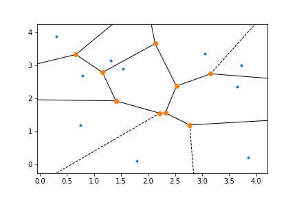

name: inter-slide
class: left, middle, inverse

{{content}}

---
name: layout-general
layout: true
class: left, middle


```{r setup, child="loaders_fixers.Rmd", echo=FALSE, message=FALSE, warning=FALSE}
```


```{r, echo=FALSE, message=FALSE, warning=FALSE}
knitr::opts_chunk$set(fig.width = 6,
                      message = FALSE,
                      warning = FALSE,
                      comment = "",
                      cache = F)

pacman::p_load(flipbookr)
pacman::p_load(FactoMineR)
pacman::p_load(FactoInvestigate)
pacman::p_load(ggrepel)
pacman::p_load(ggforce)
pacman::p_load(ggfortify)
pacman::p_load(broom)
pacman::p_load(vcd)
pacman::p_load(FactoMineR)
pacman::p_load(factoextra)
pacman::p_load(data.table)
pacman::p_load(ggmosaic)
opts <- options()  # save old options

gc <- options(ggplot2.discrete.colour="viridis")
gc <- options(ggplot2.discrete.fill="viridis")
gc <- options(ggplot2.continuous.fill="viridis")
gc <- options(ggplot2.continuous.colour="viridis")

#xaringanExtra::use_scribble()
```


```{r, eval=FALSE, load_refs, echo=FALSE, cache=FALSE, warning=FALSE, message=FALSE}
require(RefManageR, quietly = TRUE)
foobar <- BibOptions(check.entries = FALSE,
           bib.style = "authoryear",
           cite.style = 'authoryear',
           style = "markdown",
           hyperlink = FALSE,
           dashed = FALSE)
myBib <- ReadBib("./mon_chapeau.bib", check = FALSE, )
```


```{r, eval=FALSE, echo=FALSE, warning=FALSE, message=FALSE}
NoCite(myBib, "MR3851754")
NoCite(myBib, "MR3080408")
NoCite(myBib, "MR3316191")
NoCite(myBib, "MR3316191")
NoCite(myBib, "zbMATH06322139")
NoCite(myBib, "Har75")
NoCite(myBib, "MR2677125")
NoCite(myBib, "HaTiFr01")
NoCite(myBib, "Mur12")
```

---

```{r child="title_slide.Rmd"}

```


---
exclude: true
template: inter-slide


# Exploratory Data Analysis VIII k-Means

### `r Sys.Date()`

#### [`r params$curriculum`](`r params$homepage_curriculum`)

#### [`r params$coursetitle`](`r params$homepage`)

#### [`r params$lecturer`](http://stephane-v-boucheron.fr)

---
class: middle, inverse

## `r fontawesome::fa("map", fill="white")`

### [Clustering problem](#clusterPb)

### [Kleinberg's Theorem](#kleinberg)

### [Flavors of clustering](#flavors)

### [_k_-Means](#kmeans)

### [_k_-Means and Quantization](#quantization)

---
name:clusterPb
template: inter-slide

## Clustering problems

---
### In words


Clustering consists in _partitioning_  points collections
from some metric space

in such a way that

- points within the same group are close enough

while

- points from different groups are distant


???

In the background: some notion of distance/similarity


---

### Clustering in ML applications

Clustering shows up in many Machine Learning applications, for example:

-   `r fontawesome::fa("ad")` __Marketing__: finding groups of customers with similar
    behavior given a large database of customer data containing their
    properties and past buying records

-   `r fontawesome::fa("hippo")` __Biology__: classification of plants and animals given their
    features

-   `r fontawesome::fa("book")` __Bookshops__: book ordering (recommendation)

-   `r fontawesome::fa("car-crash")` __Insurance__: identifying groups of motor insurance policy
    holders with a high average claim cost; identifying frauds

-  `r fontawesome::fa("city")` __City-planning__: identifying groups of houses according to
    their type, value and geographical location

-   `r fontawesome::fa("network-wired")` __Internet__: document classification; clustering weblog data
    to discover groups of similar access patterns; topic modeling

???

Many distinct goals: clustering is often just one step in a data analysis pipeline

For recommendation systems, marketing, objects that fit into the same group call for the same action

Some clustering should be hierarchical (toxonomy in life sciences) others can just be flat

---


A clustering application relies on  the elaboration of
a _metric/dissimilarity_ over some input space

This tasks is entangled  with _feature engineering_

Focus on one specific context: _market segmentation_  `r fontawesome::fa("chart-pie")`

-   `r fontawesome::fa("database")` __Data__: Base of customer data containing their properties
    and past buying records

-   `r fontawesome::fa("bullseye")` __Goal__: Use the customers *similarities* to find groups

-   __Possible directions:__

    + Dimension reduction (PCA, CA, MCA, ...)

    + __Clustering__ $\approx$ _non-supervised classification_

???

Are the directions complementary? or not?

Clustering may be done before dimension reduction or the other way

---

### `r fontawesome::fa("binoculars")` Dimension reduction

Dimension reduction technologies start form:

-   Training data
    $\mathcal{D}=\{\vec{X}_1,\ldots,\vec{X}_n\} \in \mathcal{X}^n$ (i.i.d.
    $\sim \Pr$)

-   Space $\mathcal{X}$ of possibly high dimension.

and elaborate a  _Dimension Reduction Map_

Dimension reduction technologies construct a map $\Phi$ from the space $\mathcal{X}$
into a space $\mathcal{X}'$ of __smaller dimension__

---

###  `r fontawesome::fa("binoculars")` Clustering techniques

Clustering techniques start from  _training data_:

$$\mathcal{D}=\{\vec{X}_1,\ldots,\vec{X}_n\} \in \mathcal{X}^n$$

assuming $\vec{X}_i \sim_{\text{i.i.d.}} \Pr$,  and partition the data into (latent?) groups,

Clustering techniques construct a map $f$ from $\mathcal{D}$ to $\{1,\ldots,K\}$ where $K$
is a number of classes to be fixed: $f: \quad \vec{X}_i \mapsto k_i$

---

### Dimension reduction and clustering may be combined

For example, it is
commonplace to first perform PCA, project the data on the leading principal components
and then perform $k$-means clustering on the projected data

Clustering tasks may be motivated along different directions:

-   The search for an interpretation of groups

-   Use of groups in further processing (prediction, ...)


???

This is especially true as many clustering approaches suffer from the curse of dimensionality

---

### Good clustering

We need to define the __quality of a cluster__  `r fontawesome::fa("medal")`

Unfortunately, no obvious quality measure exists! `r fontawesome::fa("frown")`

Clustering quality may be assessed by scrutinizing

-   _Inner homogeneity_: samples in the same group should be similar

-   _Outer inhomogeneity_: samples in two different groups should be
    different.

---

### Shades of similarity

There are many possible definitions of _similar_ and _different_

Often, they are  based on the distance between the samples

Examples based on the (squared) Euclidean distance:

-   Inner homogeneity $\approx$ intra class variance/inertia,

-   Outer inhomogeneity $\approx$ inter class variance/inertia.

Remember that, in flat clustering,
the choice of the number $K$ of clusters is often delicate

---
template: inter-slide
name: kleinberg


## Kleinberg's theorem

---

###  `r fontawesome::fa("exclamation-triangle")`

- Clustering is not a single method

- Clustering methods address a large range of   problems.

???

Turning this informal statement into a formal definition proves challenging.

---

### Definition Clustering function

Define a _clustering function_ $F$ as a function that

- takes as input any finite domain $\mathcal{X}$ with a dissimilarity function $d$ over its pairs

and

- returns a partition of $\mathcal{X}$


---

### Desirable properties

A clustering function should ideally satisfy the next three properties

1. _Scale Invariance_. For any domain set $\mathcal{X}$, dissimilarity function $d$, and any
$\alpha>0$, the following should hold: $F(\mathcal{X},d) = F(\mathcal{X},\alpha d)$.

2. _Richness_ For any finite $\mathcal{X}$ and every partition $C = (C_1,\ldots,C_k)$ of $\mathcal{X}$ (into
nonempty subsets) there exists some dissimilarity function $d$ over $\mathcal{X}$ such that
$F(\mathcal{X},d)=C$.

3.  _Consistency_ If $d$ and $d'$ are dissimilarity functions over $\mathcal{X}$, such that
for all $x, y \in \mathcal{X}$,
    +  if $x,y$ belong to the same cluster in $F(\mathcal{X},d)$ then $d'(x,y) \leq d(x,y)$,
    + if $x,y$ belong to different clusters in $F(\mathcal{X},d)$ then $d'(x,y) \geq d(x,y)$,

then $F(\mathcal{X},d) = F(\mathcal{X},d')$.

---

`r fontawesome::fa("smile")` Designing clustering functions meeting simultaneously _any two_ of the _three_ properties is doable

but

`r fontawesome::fa("frown")`  The three reasonable goals are _conflicting_

### Kleinberg's impossibility theorem

.bg-light-gray.b--light-gray.ba.bw1.br3.shadow-5.ph4.mt5[

**No** clustering function $F$ satisfies simultaneously all  three properties:

- _Scale Invariance_,

- _Richness_, and

- _Consistency_

]


---
template: inter-slide
name: flavors

## Flavors of clustering

---

### Flat/Hierarchical and ...

A wide variety of clustering methods have been used in Statistics and Machine Learning.

- __Flat clustering (for example $k$-means)__ partitions  sample into a fixed
number of classes (usually denoted by $k$). The partition is determined by
some algorithm

.f6[The ultimate objective is to optimize some cost function.
Whether the objective is achieved or even approximately achieved using
a reasonable amount of computational resources is not settled]

- __Model based clustering__ is based on a generative model: data are assumed
to be sampled from a specific model (usually finite mixtures of Gaussians, the model may or may not be parametric)

.f6[Clustering consists in fitting such a mixture model and then assigning sample points to mixture components]

- _Hierarchical clustering_ is the topic of next lesson

---

### Carte du tendre

.fl.w-30.f6[In Machine Learning, $k$-means and hierarchical clustering   belong to a range of tasks called _non-supervised learning_

This contrasts with regression which belongs to the realm of _supervised learning_
]

.fl.w-70[


]

---
template: inter-slide
name:  kmeans

## _k_-means

---


The $k$-means algorithm is an iterative method that constructs a sequence
of Voronoï partitions

A Voronoï diagram draws the nearest neighbor regions around a set of points.

### Definition: Voronoï partitions

Assume:

- sample $X_1, \ldots, X_n$ from $\mathbb{R}^p$
- $\mathbb{R}^p$ is endowed with a metric $d$, usually $\ell_2$, sometimes
a weighted $\ell_2$ distance or $\ell_1$

Each cluster is defined by a _centroid_

The collection of centroids is (sometimes)  called the _codebook_ $\mathcal{C}=c_1, \ldots, c_k$

Each centroid $c_j$ defines a class:

$$C_j = \bigg\{ X_i : d(X_i, c_j) = \min_{j' \leq k} d(X_i, c_{j'})\bigg\}$$

and more generally a _Voronoï cell_ in $\mathbb{R}^p$

$$C_j = \bigg\{ x :  x \in \mathbb{R}^p, d(x, c_j) = \min_{j' \leq k} d(x, c_{j'})\bigg\}$$


---

### A Voronoï tesselation

<!-- .middle.center[] -->

.fl.w-70.pa2[
```{r, echo=FALSE}
set.seed(45056)
x <- sample(1:200,100)
y <- sample(1:200,100)
points <- data.frame(x, y,
                     distance = sqrt((x-100)^2 + (y-100)^2))
# circle <- data.frame(x = 100*(1+cos(seq(0, 2*pi, length.out = 2500))),
#                      y = 100*(1+sin(seq(0, 2*pi, length.out = 2500))),
#                      group = rep(1,2500))

# ggplot(points) +
#     stat_voronoi(aes(x=x, y=y, fill=distance)) +
#     coord_fixed()

ggplot(points) +
    aes(x=x, y=y) +
    geom_point(size=.2) +
    stat_voronoi(geom="path") +
    coord_fixed()

# ggplot(points) +
#     stat_voronoi(aes(x=x, y=y,fill=distance),
#                  outline=circle) +
#     coord_fixed()
```
]

.fl.w-30.pa2.f6[

#### Euclidean distance, dimension 2

A voronoi tesselation generated by $100$
points picked at random on the gred $\{1,\ldots, 200\}^2$

Note that cell boundaries are line segments

Note that centroids may lie close to boundaries

The position of the centroid of a Voronoi cell depends on the positions
of the centroids of the neighboring cells

]


???

See [`ggforce`](https://ggforce.data-imaginist.com/reference/index.html)

---

### A Voronoi partition for projected Iris dataset

.fl.w-30.pa2[

The black points marked with a cross define three centroids.

The straight lines delimit the Voronoï cells defined by the three centroids.

The colored points come from the Iris dataset:
each point is colored according to the the cell it belongs to.

]

.fl.w-70.pa2[

.panelset[
.panel[.panel-name[Code]

```{r voronoi, fig.height=4, fig.show='hide'}
data(iris)
pacman::p_load(ggvoronoi)

kms <- kmeans(iris[,1:2], 3)

df_centers <- as.data.frame(kms$centers) %>%
  tibble::rownames_to_column(var=".cluster")

broom::augment(kms, iris) %>%
  ggplot() +
  aes(x=Sepal.Length, y=Sepal.Width, colour=.cluster) +
  geom_point(aes()) +
  stat_voronoi(data = df_centers,   #<<
               geom="path",
               outline=data.frame(x=c(4, 8, 8, 4), y=c(2, 2, 4.5, 4.5))
               ) +
  geom_point(data = df_centers,   #<<
             colour = "black",
             shape="+",
             size=5) +
  coord_fixed() +
  labs(col="Voronoï cells") +
  ggtitle("Kmeans over Iris dataset, k=3")
```
]

.panel[.panel-name[Plot]

`)

]
]
]
---
exclude: true


```{r}
geom_sugar <- function(df_centers, species=TRUE){
  list(
    if (species)  geom_point(aes(shape=Species, color=.cluster))
    else
    geom_point(aes(color=.cluster)),
    stat_voronoi(data = df_centers,
                 geom="path",
                 outline=data.frame(x=c(4, 8, 8, 4), y=c(2, 2, 4.5, 4.5))
                 ),
    geom_point(data = df_centers,   #<<
               colour = "black",
               shape="+",
               size=5),
    coord_fixed(),
    labs(col="Voronoï cells")
)}


broom::augment(kms, iris) %>%
  ggplot(aes(x=Sepal.Length, y=Sepal.Width)) +
  geom_sugar(df_centers, species=FALSE)
```


---
### _k_-means objective function

The $k$-means algorithm aims at building a _codebook_ $\mathcal{C}$ that minimizes
$$\mathcal{C} \mapsto \sum_{i=1}^n \min_{c \in \mathcal{C}}  \Vert X_i - c\Vert_2^2$$
over all codebooks with given cardinality

If $c \in \mathcal{C}$ is the closest centroid to $X \in \mathbb{R}^p$,
$$\|c - X\|^2$$ is the _quantization/reconstruction error_ suffered when using codebook $\mathcal{C}$ to approximate $X$

`r fontawesome::fa("exclamation-triangle")` If there are no restrictions on the dimension of the input space, on the number of centroids, or on sample size, computing an optimal codebook is a $\mathsf{NP}$ -hard problem

???

$k$-means has a lot to do with rate-distortion coding


---

### $k$-means at work

.fl.w-30.pa2[

We may figure out what an optimized Voronoï partition  looks like on the Iris dataset

`kmeans` with $k=3$ on the Iris dataset

Function `kmeans` is run with default arguments

We chose the `Sepal` plane for clustering and visualization

This is arbitrary. We could have chosen a `Petal`  plane, a `Width` plane, or a plane defined by principal axes.
]

.fl.w-70.pa2[

.panelset[
.panel[.panel-name[Code]

```{r iriskmeans3, fig.show='hide', fig.height=5}
kms <- kmeans(select(iris, Sepal.Length, Sepal.Width), 3)

broom::augment(kms, iris) %>%
 ggplot() +
 geom_point(aes(x=Sepal.Length, y=Sepal.Width,
            shape=Species, col=.cluster)) +
 geom_point(data=data.frame(kms$centers),        #<<
            aes(x=Sepal.Length, y=Sepal.Width),
            shape='+',
            size=5) +
 stat_voronoi(data = as.data.frame(kms$centers),  #<<
               aes(x=Sepal.Length,y=Sepal.Width),
               geom="path",
               outline=data.frame(x=c(4, 8, 8, 4), y=c(2, 2, 4.5, 4.5))) -> p

p +
  ggtitle("K-means with k=3", "Iris data") +
  labs(col="Clusters")
```
]

.panel[.panel-name[Plot]

`)

]]]


---

### A $k$-means clustering is completely characterized by the $k$ centroids

Once centroids are known, clusters can be recovered by searching the closest
centroid for each sample point (that is by delimiting the Voronoï cells).

- How can we assess the _quality_ of a $k$-means clustering?

- Can we compare the clusterings achieved by picking different values of $k$?

There is no obvious assessment criterion!


???

The _quality_ of a clustering can be appreciated according to a wide variety of performance indicators

- Distortion: this is the $k$-means cost
- Shape of clusters
- Relevance of clusters
- Stability: does clustering depend on few points?

---

### Caveat

When visualizing $k$-means clustering on `Iris` data, we are cheating.  `r fontawesome::fa("theater-masks")`

We have a gold standard classification delivered by botanists

The botanists classification can be challenged

We can compare classification originating from _phenotypes_ (appearance) and classification based on _phylogeny_ (comparing DNAs)  `r fontawesome::fa("dna")`

---

### Summarising a $k$-means clustering

.fl.w-50.pa2[

A clustering can be summarized and illustrated.

In `r fontawesome::fa("r-project")` A meaningful summary is provided
by the generic function `summary()`, or a `tidy` summary is providede by
`broom::tidy(...)`

```{r iris3-tidy, results='hide'}
select(iris, Sepal.Length, Sepal.Width) %>%
  kmeans(centers = 3) %>%
  broom::tidy() %>%       #<<
  knitr::kable(format = "markdown",
               digits = 2) -> t
```

]

.fl.w-50.pa2[


.f6[

```{r, echo=FALSE}
t
```

The concise summary  tells us the number of points that are assigned to each cluster, and the Within Sum of Squares (WNSS). It says something
about inner homogeneity and (apparently) nothing about outer homogeneity


]

]

---

### $k$-means with $k=2$

.fl.w-30.pa2[
We pursue the exploration of `kmeans` by building another clustering for Iris dataset.

This times  with $k=2$.

]


.fl.w-70.pa2[

.panelset[
.panel[.panel-name[Code]

```{r iriskmeans2, fig.show='hide', fig.height=5}
kms <- kmeans(select(iris, Sepal.Length, Sepal.Width), 2)
iris2 <- broom::augment(kms, iris)

broom::augment(kms, iris) %>%
 ggplot() +
 geom_point(aes(x=Sepal.Length, y=Sepal.Width,
            shape=Species, col=.cluster)) +
 geom_point(data=data.frame(kms$centers),   #<<
            aes(x=Sepal.Length, y=Sepal.Width),
            shape='+',
            size=5) +
 stat_voronoi(data = as.data.frame(kms$centers),   #<<
               aes(x=Sepal.Length,y=Sepal.Width),
               geom="path",
               outline=data.frame(x=c(4, 8, 8, 4), y=c(2, 2, 4.5, 4.5)))  +
  ggtitle(label="Kmeans Iris data",
          subtitle="k=2") +
  labs(col="Clusters")
```
]

.panel[.panel-name[Plot]

`)


]

.panel[.panel-name[Numerical summary]

```{r iris2-tidy, echo=FALSE}
select(iris, Sepal.Length, Sepal.Width) %>%
  kmeans(centers = 2) %>% #<<
  broom::tidy() %>%       #<<
  knitr::kable(format = "markdown",
               digits = 2)
```


]


]]


---

### `r fontawesome::fa("question")` How should we pick $k$?

.fl.w-30.pa2.f6[

Even if we could compute a provably  optimal codebook for each $k$,
choosing $k$ would not be obvious

A common recipe consists of
plotting within clusters sum of squares (`WNSS`) against $k$

Within clusters sum of squares (WNSS) decreases sharply between $k=2$ and $k=3$

For larger values of $k$, the decay is much smaller.

The _elbow_ rule of thumb suggests to choose $k=3$.
]


.fl.w-70.pa2[

.panelset[
.panel[.panel-name[Code]

```{r, echo=TRUE}
df <- select(iris, 
             starts_with("Sepal"))

tmp <-map_dfr(2:10, ~ glance(kmeans(df, 
                                   centers=.,
                                   nstart = 32L))) %>% 
  rowid_to_column(var="k") %>% 
  mutate(k=k+1) 
```


.f6[
We have run  `kmeans` over the Iris dataset, for $k$ in range $2, \ldots, 10$. For each value of $k$,  we performed $32$ randomized initializations, and chose the partition that minimizes within clusters sum of squares

]

]

.panel[.panel-name[Numerical summary]

```{r, echo=FALSE}
tmp %>%
  knitr::kable(format="markdown", digits=2)
```


]

.panel[.panel-name[Elbow plot]

```{r iriswithinss, echo=FALSE, fig.height=5}
tmp %>%
  ggplot(aes(x=forcats::as_factor(k), y=tot.withinss/totss)) +
  geom_col(width=.25) +
  ggtitle("Iris data", "WithinSS/Total Sum of Squares as a function of k") +
  xlab("k") +
  ylab("Within Clusters Sum of Squares (relative)") +
  scale_x_discrete(breaks=as.character(2:10), labels=as.character(2:10))
```

]
]]


???

```{r}


```

---

### Incentive to choose $k=4$?

.fl.w-30.pa2[
Depending on initialization, taking $k=4$ creates a cluster at the boundary between `versicolor` and `virginica` or it may split the `setosa` cluster
]

.fl.w-70.pa2[
```{r iriskmeans4, echo=FALSE, fig.cap='(ref:iriskmeans4)'}
kms <- kmeans(select(iris, Sepal.Length, Sepal.Width), 4)
iris4 <- broom::augment(kms, iris)

ggplot(iris4) +
geom_point(aes(x=Sepal.Length, y=Sepal.Width,
           shape=Species, col=.cluster)) +
geom_point(data=data.frame(kms$centers),          #<<
           aes(x=Sepal.Length, y=Sepal.Width),
           shape='+',
           size=5) +
stat_voronoi(data = as.data.frame(kms$centers),   #<<
              aes(x=Sepal.Length,y=Sepal.Width),
              geom="path",
              outline=data.frame(x=c(4, 8, 8, 4), y=c(2, 2, 4.5, 4.5)))  +
 ggtitle(label="Kmeans Iris data",
         subtitle="k=4") +
 labs(col="Clusters")
```
]
---

```{r}
broom::tidy(kmeans(select(iris, Sepal.Length, Sepal.Width), 4)) %>%
  knitr::kable(format = "markdown", digits = 2)
```

---

### Initialization matters!

.fl.w-40.pa2[
- Initialize by samples.

- `k-Mean++`  try to take them as separated as possible.

- No guarantee to converge to a global optimum!

- Trial and error.

- Repeat and keep the best result.
]

.fl.w-60.pa2[

```{r, eval=FALSE, echo=TRUE}
kmeans(x,       # data
       centers, # initial centroids or number of clusters
       iter.max = 10,
       nstart = 1,  # number of trials
       algorithm = c("Hartigan-Wong", # default
                     "Lloyd",         #<< old one
                     "Forgy",
                     "MacQueen"),
       trace=FALSE)
```

]

???

TODO:
  one dimensional example with animation (plotly)


---
exclude: true

```{r}
kms <- kmeans(select(iris, Sepal.Length, Sepal.Width),
              centers = 3,
              iter.max = 100,
              nstart= 1,
              trace = 10)
```


---

### Lloyd's Algorithm (detailed) for fixed _k_ (naive _k_-means)

1. Initialize
  Choose $k$ centroids

2. Iterations: Two phases
   1. (Movement) Assign each sample point to the closest _centroid_
   Assign each sample point to a class in the Voronoi partition defined by the centroids
   1. (Update) For each class in the current Voronoi partition, update teh  _centroid_ so as to minimize the Within Cluster Sum of Squared distances.


???

From `scikit-learn` documentation

> The k-means problem is solved using either Lloyd’s or Elkan’s algorithm.

> The average complexity is given by $O(k \times n \times T)$, were $n$ is the number of samples and $T$ is the number of iterations.

> The worst case complexity is given by $O(n^(k+2/p))$ with $n = n_{\text{samples}}$, $p = n_{\text{features}}$. (D. Arthur and S. Vassilvitskii, ‘How slow is the k-means method?’ SoCG2006)

> In practice, the k-means algorithm is very fast (one of the fastest clustering algorithms available), but it falls in local minima. That’s why it can be useful to restart it several times.

> If the algorithm stops before fully converging (because of `tol` or `max_iter`), `labels_` and `cluster_centers_` will not be consistent, i.e. the `cluster_centers_` will not be the means of the points in each cluster. Also, the estimator will reassign `labels_` after the last iteration to make `labels_` consistent with predict on the training set.

---

### Lloyd's iterations

```{r, echo=FALSE, message=FALSE, warning=FALSE}
iris_numeric <- select(iris, Sepal.Length, Sepal.Width)
km <- list(centers=iris_numeric[1:3, ]) # stupid initialization

sequence <- list()

for (i in 1:20) {
  km <- kmeans(iris_numeric,
               km$centers,
               algorithm = "Lloyd",
               iter.max = 1)
  sequence[[length(sequence)+1]] <- force(km)
}

add_voronoi <- function(p, kmscenters, marker){
  p +
    geom_point(data=data.frame(kmscenters),         #<<
               mapping=aes(x=Sepal.Length, y=Sepal.Width),
               shape=marker,
               col="black",
               size=5) +
    stat_voronoi(data = as.data.frame(kmscenters),  #<<
                 aes(x=Sepal.Length,y=Sepal.Width),
                 geom="path",
                 outline=data.frame(x=c(4, 8, 8, 4),
                                    y=c(2, 2, 4.5, 4.5)))
}
```


```{r lloyd1, echo=FALSE, fig.cap="After 1 step", fig.width=12, fig.height=8}
i <- 2

p <- broom::augment(sequence[[i]], iris) %>%
  ggplot() +
  coord_fixed(ratio=1) +
  geom_point(aes(x=Sepal.Length, y=Sepal.Width, shape=Species, col=.cluster)) +
  ggtitle("Kmeans Lloyd's algorithm", "Iris data")

p %>%
  add_voronoi(sequence[[i]]$centers, marker="o") +   #<<
  labs(colour=paste("Cluster, step ", i- 1))
```

---

### Lloyd's iterations  (continued)

```{r lloyd5, echo=FALSE, fig.cap="After 2 steps", fig.width=12, fig.height=8}
i <- 3

(p %+%
  broom::augment(sequence[[i]], iris)) %>%
  add_voronoi(sequence[[i]]$centers, marker='+') +   #<<
  geom_point(data=data.frame(sequence[[2]]$centers),   #<<
             mapping=aes(x=Sepal.Length, y=Sepal.Width),
             shape="o", col="black", size=5) +
  labs(colour=paste("Cluster, step ", i- 1))
```

---

### Lloyd's iterations (continued)

```{r lloyd00, echo=FALSE, fig.cap="After 4 steps", fig.width=12, fig.height=8}
i <- 5

(p %+%
  broom::augment(sequence[[i]], iris)) %>%
  add_voronoi(sequence[[i]]$centers, marker='*') +   #<<
  geom_point(data=data.frame(sequence[[2]]$centers),   #<<
             mapping=aes(x=Sepal.Length, y=Sepal.Width),
             shape="o", col="black",size=5) +
  labs(colour=paste("Cluster, step ", i- 1))
```

---

### Analysis

Given

- codebook $\mathcal{C} =\big\{c_1, \ldots, c_k\big\}$ and
- clusters $C_1, \ldots C_k$,

the  _within-clusters sum of squares_ is defined as
$$\sum_{j=1}^k  \sum_{i: X_i \in C_j} \bigg\Vert c_j - X_i \bigg\Vert^2$$

`r fontawesome::fa("hand-point-right")` This is also the kmeans cost

### Lemma

.bg-light-gray.b--light-gray.ba.bw1.br3.shadow-5.ph4.mt5[

At each stage, the _within clusters sums of squares_ does not increase

]

???

There is no guarantee that the algorithm will converge in few
iterations

Iterations are carried out in a brute force manner

---

### Proof

Let $\mathcal{C}^{(t)} =\big\{ c^{(t)}_1, \ldots, c_k^{(t)}\big\}$ be the codebook after $t$ steps

Let $\big({C}^{(t)}_j\big)_{j \leq k}$ be the clusters after $t$ steps

- Centroids at step $t+1$ are the barycenters of clusters $\big({C}^{(t)}_j\big)_{j \leq k}$

$$c^{(t+1)}_j = \frac{1}{|C_j^{(t)}|} \sum_{X_i \in C^{(t)}_j} X_i$$

- Clusters $C^{(t+1)}_j$ are defined by

$$C^{(t+1)}_j = \bigg\{ X_i : \Vert X_i -  c^{(t+1)}_j\Vert = \min_{c \in \mathcal{C}^{(t+1)}} \Vert X_i -  c\Vert \bigg\}$$

Each sample point is assigned to the closest centroid

---


### Proof (continued)

$$\sum_{j=1}^k \sum_{X_i \in C^{(t)}_j} \bigg\Vert c^{(t)}_j  - X_i\bigg\Vert^2  \geq \sum_{j=1}^k \sum_{X_i \in C^{(t)}_j} \bigg\Vert c^{(t+1)}_j  - X_i\bigg\Vert^2$$

since for each $j$, the mean $c^{(t+1)}_j$ minimizes the average square distance to points in $C^{(t)}_j$

$$\sum_{j=1}^k \sum_{X_i \in C^{(t)}_j} \bigg\Vert c^{(t+1)}_j  - X_i\bigg\Vert^2 \geq \sum_{j=1}^k \sum_{X_i \in C^{(t)}_j} \min_{c \in \mathcal{C}^{(t+1)}}\bigg\Vert c  - X_i\bigg\Vert^2$$

$$\sum_{j=1}^k \sum_{X_i \in C^{(t)}_j} \min_{c \in \mathcal{C}^{(t+1)}}\bigg\Vert c  - X_i\bigg\Vert^2 = \sum_{j=1}^k \sum_{X_i \in C^{(t+1)}_j} \bigg\Vert c^{(t+1)}_j  - X_i\bigg\Vert^2$$

`r fontawesome::fa("square")`

---

### `r fontawesome::fa("code-branch")` Variants of _k_-means

Implementations of  $k$-means vary with respect to

- Initialization
  + `k-means++`
  + Forgy : pick initial centroids at random from the dataset
  + Random partition : pick a random partition of the dataset and initialize centroids by computing means in each class
  + ...

- Movement/assignment
  + Naive $k$ means uses  brute-force search for closest centroid. Each step requires $\Omega(n \times k)$ operations
  + Elkan (used by `r fontawesome::fa("python")` `scikit-learn`)
  + Hartigan-Wong `r fontawesome::fa("r-project")` default
  + ...


???

> Lloyd's algorithm is the standard approach for this problem. However, it spends a lot of processing time computing the distances between each of the k cluster centers and the n data points. Since points usually stay in the same clusters after a few iterations, much of this work is unnecessary, making the naïve implementation very inefficient. Some implementations use caching and the triangle inequality in order to create bounds and accelerate Lloyd's algorithm. .fr.f6[Wikipedia]


In base `r fontawesome::fa("r-project")`, `kmeans` is a wrapper for different but related algorithms.

Lloyd's algorithm is the first and simplest versions of a series of heuristic methods designed to minimize the k-means cost

- `MacQueen`  modify the mean each time a sample is assigned to a new cluster

- `Hartigan-Wong` is the _default_ method. It modifies the mean by removing the considered
sample point, assign it to the nearby center and recompute the new mean after assignment.

- `Forgy`


---
template: inter-slide
name: pcaandkmeans


## Combining PCA and $k$-means

---

### `r fontawesome::fa("binoculars")`

The result of a clustering procedure like `kmeans` can be visualized by projecting the dataset on a pair of native variables and  using some aesthetics to emphasize the clusters


This is not always the best way.

First choosing a pair of native variables may not be straightforward. The projected pairwise distances may not faithfully reflect the pairwise distances that serve for clustering.

It makes sense to project the dataset
of the $2$-dimensional subspace that maximizes the projected inertia, that is on the space generated
by the first two principal components

---

### PCA, projection, $k$-means

.fl.w-30.pa2.f6[
The kmeans clustering of the Iris dataset is projected on the first two principal components: `prcomp` is used to perform PCA with neither centering nor scaling

`kmeans` is applied to the rotated data

The straight lines are the not the projections of the boundaries of the (4-dimensional) Voronoï cells defined by the clusters centroids, but the boundaries of the 2-dimensional Voronoï celles defined by the projections of the cluster centroids

]
.fl.w-70.pa2[

.panelset[

.panel[.panel-name[Code]

```{r, echo=TRUE}
iris_a <- broom::augment(prcomp(x = iris[, -5],
                         center = FALSE,
                         scale.=FALSE,
                         rank. = 4), iris)

km3 <- iris_a %>%
  select(starts_with(".fitted")) %>%
  kmeans(3, nstart = 20)

iris_a <- broom::augment(km3, iris_a)
```

]

.panel[.panel-name[Plot cooking]

```{r pcakmeans, fig.show='hide', fig.height=5}
ggplot(data=iris_a,
       aes(x=.fittedPC1, y=.fittedPC2)) +
    coord_fixed(ratio=1) +
    stat_voronoi(data=data.frame(km3$centers),    #<<
                     geom="path",
               outline = data.frame(x=c(-12, -4, -4 , -12),
                                    y=c(-3, -3, 4, 4))) +
  geom_point(aes(shape=Species, col=.cluster)) +
  geom_point(data=data.frame(km3$centers),   #<<
             aes(x=.fittedPC1, y=.fittedPC2),
             shape='+', size=5) +
  xlab("PC1") +
  ylab("PC2") +
  labs(col="Cluster") +
  ggtitle('Kmeans clustering of Iris dataset projected on first principal components.')
```
]

.panel[.panel-name[Plot]

`)
]
]]


???


---

### `r fontawesome::fa("question")` Questions around _k_-means

- Choosing $k$

- Assessing clustering quality

- Scaling or not scaling ?

- Choosing a distance

- Initialization methods

- Movement/assignment update

- Stopping rules

-

---
exclude: true

```{r quantization, child="cm-8-EDA-quantization.Rmd", eval=F}

```

---

### `r fontawesome::fa("bullhorn")` Conclusion

- Euclidean distance is used as a metric and inertia is used as a measure of cluster scatter

- The number of clusters $k$ is an input parameter

- Convergence to a local minimum may produce counterintuitive ("wrong") results


???

Squared Euclidean distance is very sensitive to outliers

An inappropriate choice of k may yield poor results. That is why, when performing k-means, it is important to run diagnostic checks for determining the number of clusters in the data set.


---
exclude: true

### References

.f6[

```{r, 'references', results='asis', echo=FALSE, message=FALSE, warning=FALSE, eval=FALSE}
PrintBibliography(myBib)
```

]


---

```{r child="closing_slide.Rmd"}
```
